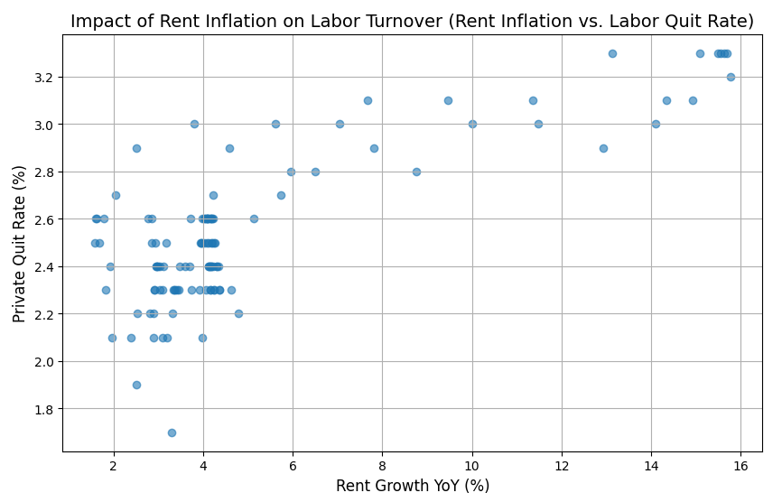

# 美國租金年增率與勞動力流動性：基於滯後回歸模型的實證分析 (An Empirical Analysis of Rent Inflation and Labor Mobility in the United States: A Lagged Regression Approach)

## 📌 研究動機 (Research Motivation)
本研究旨在探討居住成本上升是否構成勞動市場的摩擦力，進而影響離職率與勞動力配置效率。
參考 **Zabel (2012)** 提出的「鎖定效應 (Lock-in Effect)」，高房價可能抑制勞工移動。然而，在當前高通膨環境下，巨大的生活成本壓力也可能成為勞工轉職的「推力 (Push Factor)」，促使其尋求更高薪資以緩解支出壓力。本專案從總體經濟視角，探討租金成長與勞動市場流動性之間的關聯。

## 📊 資料描述 (Data Description)
本專案整合了美國國家層級的權威數據源：
- **租金指數 (X)**：來源為 **Zillow Observed Rent Index (ZORI)**。
- **自願離職率 (Y)**：來源為 **FRED JOLTS Quit Rate (Seasonally Adjusted)**。
- **原始資料範圍**：2015/01 - 2025/08。
- **觀測值總數**：128 筆 (月資料)。

## 🛠️ 資料預處理 (Data Preprocessing)
本專案進行以下資料整理與前處理：
- **格式轉換**：將 Zillow 原始資料進行 Melt 處理，轉化為時間序列格式並與 FRED 數據對齊。
- **特徵工程**：建構「租金年增率 (YoY)」變數。於處理缺失值後，最終分析樣本調整為 **2016/01 - 2025/08**，共計 **116 筆** 有效觀測值。
- **品質檢查**：統一日期索引，確保全數據無缺失值。

  

  *圖：經預處理後之租金年增率與離職率原始走勢對照（2016-2025）。*

## 📈 核心實證發現 (The Findings)
本研究透過 OLS 滯後回歸，分析租金年增率與自願離職率之間的關聯。
- **滯後相關性顯著**： **三個月前 (Lag-3)** 的租金年增率與當月自願離職率呈現顯著正向關聯。
- **回歸係數 (β)**：**0.0602 (P < 0.001)**，租金年增率增加 1 個百分點，模型預測的離職率平均增加 0.0602 個百分點。
-  **解釋力**：R-squared 為 0.453 ，表示模型可解釋樣本內約 45.3% 的離職率變異。

## 🔍 預測力與因果邏輯說明 (Predictive Power vs. Causality)
觀察到租金年增率與自願離職率之間的顯著正向關聯，但尚無法確認因果關係。
- **研究限制**：滯後回歸無法單獨排除反向因果及其他未納入因素的影響，因此結果僅解讀為統計上的關聯，而非確立的因果效果。

## 💡 策略反思 (Risk Discussion)
在投資應用上，本研究回測了利用租金訊號做多房地產 ETF (VNQ) 的表現：
- **估值風險 (Valuation Risk)**：策略在 2022 年遭遇顯著回撤，可能與聯準會升息推高折現率、壓低資產估值有關。
- **體制轉換 (Regime Shift)**：即使租金訊號仍然偏強，高利率環境下的折現率上升仍可能壓低資產估值，削弱策略表現。
- **結論**：量化策略應考量市場環境變化，單一指標在體制轉換時可能失準。

## 🛠️ 技術工具 (Tech Stack)
- **語言**：Python 3.x
- **數據處理**：Pandas, NumPy
- **統計建模**：Statsmodels (OLS Regression)
- **數據串接**：Pandas-DataReader
- **視覺化**：Matplotlib, Seaborn

## 📁 專案資源 (Project Resources)
- 🐍 **[核心分析程式碼 (Jupyter Notebook)](./US_Rent_Growth_and_Quit_Rate_Analysis.ipynb)**：包含完整的數據爬取、滯後回歸與策略回測邏輯。
- 📊 **[研究簡報 (PDF Report)](./presentation/US_Rent_Growth_and_Quit_Rate_Analysis.pdf)**：針對數據洞察、利率衝擊與策略反思的視覺化呈現。

## 👥 專案背景與團隊分工 (Project Background & Credits)
本專案起源於課程個人研究提案，因研究動機與實證初步結果獲得組員認可，選為期末團體研究主題。
- **主要負責**：資料獲取、數據清洗、統計建模、投資策略回測等程式碼撰寫，與結果分析。
- **團隊協作與討論**：與組員共同探討投資應用的可行性，並針對升息環境下的策略失效進行集體反思。
